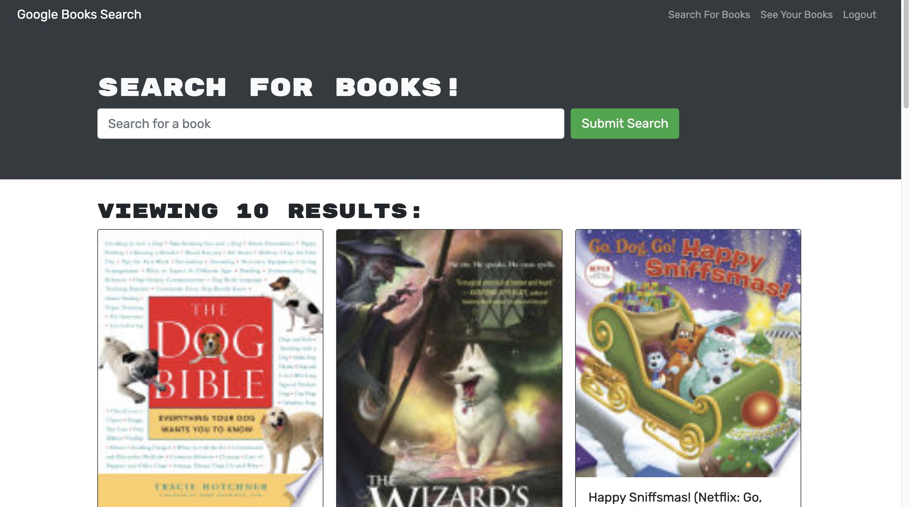

   <h1 align ="center">BookSearch<h1>

## Description
The task was to create a MERN stack application that would allow users to search up books.
# Table of Contents
* [Description](#description)
* [Technologies](#technologies)
* [Installation](#installation)
* [License](#license)
* [Contributions](#contributions)
* [Github](#github)

## Showcase
[Preview](./assets/preview.webm)
 

 

[try it out](https://booksearchapplicationn.herokuapp.com)

## Technologies

<li>Js</li>
<li>Node.js</li>
<li>React</li>

   

## License

 
This Project is licensed under the MIT license.

## Contributions

## Github
Questions? 
Contact me through my github Yahir-F

Email: placeholder@gmail.com

    